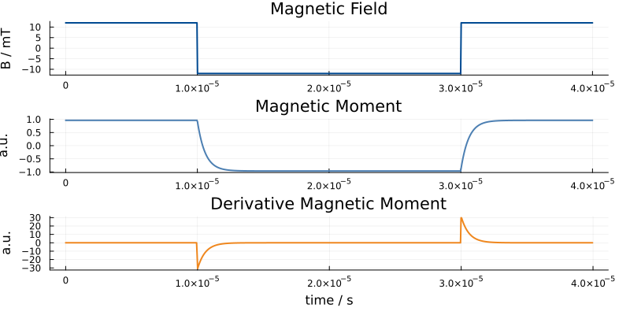

# Overview

On this page we give an overview of MNPDynamics. 

## Simple Simulation (No Relaxation)

We start with a very simple simulation. 20 nm particles are simulated without relaxation
under sinusoidal excitation. We start by loading `MNPDynamics` and define the time interval.
Here we use 1000 samples and an excitation frequency of 25 kHz:
```julia
using MNPDynamics

# Time parameters
fx = 25000;
tLength = 1000;       # length of time vector
tMax = 1/fx;          # maximum evaluation time in seconds
t = range(0, stop=tMax, length=tLength);
```
In the next step we define the applied magnetic field. This is done using by defining a 
magnetic field function `B` that maps `t` to the magnetic flux density `B`:
```julia
# Field parameters
amplitude = 0.012

# Magnetic field for simulation 
B(t) = amplitude*[cos(2*pi*fx*t), 0, 0]
```
You can of course also define this as
```julia
function B(t)
 return amplitude*[cos(2*pi*fx*t), 0, 0]
end
```
or as an anonymous function:
```julia
B = t -> (amplitude*[cos(2*pi*fx*t), 0, 0])
```
You also don't need to call it `B`.

In the next step we define additional simulation parameters in a dictionary `p` and pass
`B`, `t` and `p` to the function `simulationMNP`:
```julia
# Parameters
p = Dict{Symbol,Any}()
p[:DCore] = 20e-9                  # particle diameter in nm
p[:relaxation] = NO_RELAXATION     # relaxation mode

# Do simulation
m = simulationMNP(B, t; p...)
```
What you get back is the mean magnetic moment of the particle. Often we measure this
function inductively using a pick-up coil and then receive the time derivative of the
mean magnetic moment. The following image shows the result of this simple simulation.


## Neel Relaxation

We next repeat the simulation but change the parameter dictionary like this:

```julia
p = Dict{Symbol,Any}()
p[:DCore] = 20e-9         # particle diameter in nm
p[:α] = 0.1               # damping coefficient
p[:kAnis] = 11000         # anisotropy constant
p[:N] = 20                # maximum spherical harmonics index to be considered
p[:n] = [1;0;0]           # anisotropy axis
p[:relaxation] = NEEL     # relaxation mode
p[:reltol] = 1e-6         # relative tolerance
p[:abstol] = 1e-6         # absolute tolerance
p[:tWarmup] = 0.00005     # warmup time. The simulation is started at -tWarmup
```

The results in the following images show that the particle response now clearly lacks
behind the excitation:


Next, we switch the excitation function to be rect function.

```julia
Brect(t) = amplitude*[ 0.25 < fx*mod(t,1) < 0.75  ? -1.0 : 1.0 , 0, 0]
```

We also use a more stable solver:
```julia
p[:solver] = :Rodas5
```

The simulation result looks like this:



One can nicely see the expected exponential decay after the field changes its sign.

## Brown Relaxation

It is also possible to simulate Brownian relaxation. This can be done with the 
following parameter dictionary:

```julia
# Parameters
p = Dict{Symbol,Any}()
p[:DCore] = 20e-9         # particle diameter in nm
p[:DHydro] = 80e-9        # particle diameter in nm
p[:η] = 1e-5              # viscosity
p[:N] = 20                # maximum spherical harmonics index to be considered
p[:relaxation] = BROWN    # relaxation mode
```


!!! note
    Currently it is not possible to simulate Brownian and Neel relaxation simultaneously.

## Multiple Parameters

Quite often, the goal is to to perform multiple simulations. Since this can get quite time
intensive it can be benefitial to use parallel computation. To do this you need to start julia
with `-p P` where P is the number of CPU cores that the computer has.

Our goal is to perform simulations with the same 2D excitation but for various different
static offset fields. In the magnetic particle imaging (MPI) setting this is usually referred
to as the system matrix. In particular we aim to reproduce Fig. 4 of [this publication](https://iopscience.iop.org/article/10.1088/1367-2630/ab4938/pdf).

We start by defining the general parameters:
```julia
using MNPDynamics, FFTW

# Parameters
p = Dict{Symbol,Any}()
p[:DCore] = 20e-9         # particle diameter in nm
p[:α] = 0.1               # damping coefficient
p[:kAnis] = 1250          # anisotropy constant
p[:N] = 20                # maximum spherical harmonics index to be considered
p[:relaxation] = NEEL     # relaxation mode
p[:reltol] = 1e-4         # relative tolerance
p[:abstol] = 1e-6         # absolute tolerance
p[:tWarmup] = 0.00005     # warmup time
p[:derivative] = true
p[:solver] = :FBDF        # Use more stable solver

# Excitation frequencies
const fx = 2.5e6 / 102
const fy = 2.5e6 / 96

samplingRate = 2.5e6
tLength = lcm(96,102);             # length of time vector
tMax = lcm(96,102) / samplingRate; # maximum evaluation time in seconds
t = range(0, stop=tMax, length=tLength);
```

Next we define a more general magnetic field function, which not only
gets the time `t` but also the `offset`.

```julia
const amplitude = 0.012
B(t, offset) = amplitude*[sin(2*pi*fx*t), sin(2*pi*fy*t), 0] .+ offset 
```

We then define the offset on a ``30 x 30`` grid. This can be done in Julia in a very terse
syntax using `CartesianIndices`:
```julia
nOffsets = (30, 30, 1)

oversampling = 1.25
offsets = vec([ oversampling*amplitude.*2.0.*((Tuple(x).-0.5)./nOffsets.-0.5)  
                for x in CartesianIndices(nOffsets) ])
```
Basically, `offsets` is a vector of `Tuples` and the elements are passed to the callback function `B` we
defined before.

In addition to the offsets we also want the anisotropy axis to be offset dependent (see publication). Therefore,
we define the anisotropy axis on a grid as well: 

```julia
anisotropyAxis = vec([ oversampling*2.0.*((Tuple(x).-0.5)./nOffsets.-0.5) 
                       for x in CartesianIndices(nOffsets) ])
p[:kAnis] = p[:kAnis]*anisotropyAxis
```

Finally we perform the simulation and apply a Fourier transform along the time axis:

```julia
smM = simulationMNPMultiParams(B, t, offsets; p...)

smMFT = reshape(rfft(smM, 1), :, 3, nOffsets...)
```

The resulting dataset looks like this:

