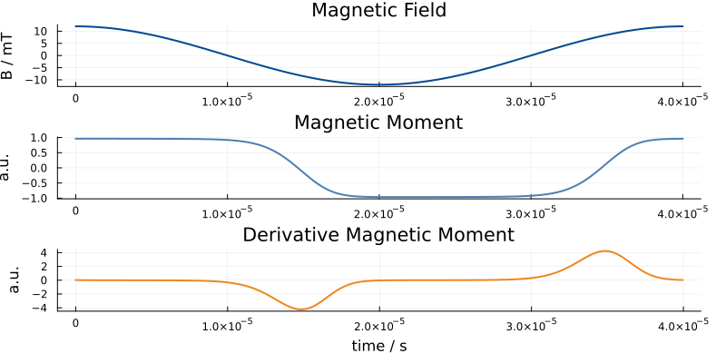

# Overview

On this page we give an overview of MNPDynamics. 

## Simple Simulation (No Relaxation)

We start with a very simple simulation. 20 nm particles are simulated without relaxation
under sinusoidal excitation. We start by loading `MNPDynamics` and define the time interval.
Here we use 1000 samples and an excitation frequency of 25 kHz:
```julia
using MNPDynamics

# Time parameters
fx = 25000;
tLength = 1000;       # length of time vector
tMax = 1/fx;          # maximum evaluation time in seconds
t = range(0, stop=tMax, length=tLength);
```
In the next step we define the applied magnetic field. This is done using by defining a 
magnetic field function `B` that maps `t` to the magnetic flux density `B`:
```julia
# Field parameters
amplitude = 0.012

# Magnetic field for simulation 
B(t) = amplitude*[cos(2*pi*fx*t), 0, 0]
```
You can of course also define this as
```julia
function B(t)
 return amplitude*[cos(2*pi*fx*t), 0, 0]
end
```
or as an anonymous function:
```julia
B = t -> (amplitude*[cos(2*pi*fx*t), 0, 0])
```
You also don't need to call it `B`.

In the next step we define additional simulation parameters in a dictionary `p` and pass
`B`, `t` and `p` to the function `simulationMNP`:
```julia
# Parameters
p = Dict{Symbol,Any}()
p[:DCore] = 20e-9                  # particle diameter in nm
p[:relaxation] = NO_RELAXATION     # relaxation mode

# Do simulation
m = simulationMNP(B, t; p...)
```
What you get back is the mean magnetic moment of the particle. Often we measure this
function inductively using a pick-up coil and then receive the time derivative of the
mean magnetic moment. The following image shows the result of this simple simulation.


## Neel Relaxation

We next repeat the simulation but change the parameter dictionary like this:

```julia
p = Dict{Symbol,Any}()
p[:DCore] = 20e-9         # particle diameter in nm
p[:α] = 0.1               # damping coefficient
p[:kAnis] = 11000         # anisotropy constant
p[:N] = 20                # maximum spherical harmonics index to be considered
p[:n] = [1;0;0]           # anisotropy axis
p[:relaxation] = NEEL     # relaxation mode
p[:reltol] = 1e-6         # relative tolerance
p[:abstol] = 1e-6         # absolute tolerance
p[:tWarmup] = 0.00005     # warmup time. The simulation is started at -tWarmup
```

The results in the following images show that the particle response now clearly lacks
behind the excitation:



Next, we switch the excitation function to be rect function.

```julia
Brect(t) = amplitude*[ 0.25 < fx*mod(t,1) < 0.75  ? -1.0 : 1.0 , 0, 0]
```

We also use a more stable solver:
```julia
p[:solver] = :Rodas5
```

The simulation result looks like this:


One can nicely see the expected exponential decay after the field changes its sign.

## Multiple Parameter